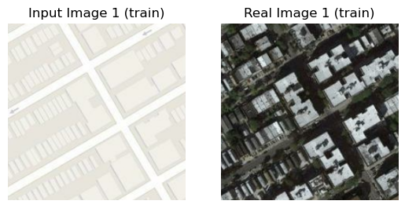
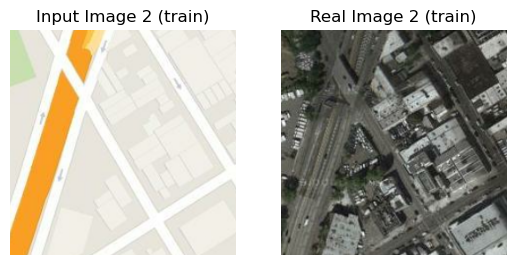

# pix2pix for Maps to Satellite Images Translation

Course: Neural Networks @ FIIT STU\
Authors: Viktor Modroczký & Michaela Hanková

The goal of this project is to implement the pix2pix model and train it on the [pix2pix Maps](http://efrosgans.eecs.berkeley.edu/pix2pix/datasets/maps.tar.gz) dataset to translate maps to satellite images. We used Kaggle Notebooks with Python 3.7.12 to train and test the model utilizing the free GPU provided by Kaggle - Nvidia Tesla P100. The requirements for the project are listed in the [`requirements.txt`](./requirements.txt) file.

## Dataset

The dataset used for this project is the paired [pix2pix Maps](http://efrosgans.eecs.berkeley.edu/pix2pix/datasets/maps.tar.gz) dataset containing 1096 training images and 1098 validation images. The dataset contains images of maps and their corresponding satellite images extracted from Google Maps. The dataset is also available on Kaggle [here](https://www.kaggle.com/datasets/alincijov/pix2pix-maps). The dataset is split into two directories - `train` and `val`.

### Dataset Preprocessing

The functions used to preprocess the dataset are in the [`src`](./src) directory of this repository in the [`pixutils.py`](./src/pixutils.py) script. The functions are `load_image`, `extract_patches`, `random_jitter`, and `rescale_images`.

The map to satellite pairs are in one jpeg file, side-by-side. The size of the images is 600x1200. For this reason, the images need to be split into two separate images. We defined a custom `tf.data.Dataset` pipeline to load the images and split them into two separate 600x600 images. This step is done right after loading the image file in a function called `load_image` which is passed to the `map` function of the dataset pipeline.

The 600x600 are relatively large images, so we incorporated a step to the pipeline to extract 256x256 patches from the images. This step is done in the `extract_patches` function which is also passed to the `map` function of the dataset pipeline. This outputs a dataset of 1096 and 1098 batches of four 256x256 patches for the training and validation sets respectively. For this reason we use the `unbatch` function to get a dataset of 4384 and 4392 patches for the training and validation sets respectively.

Next we introduce random jitter to the training images by resizing them to 286x286 and then randomly cropping them back to 256x256. After that, we horizontally flip the images with a 50% chance. This is done in the `random_jitter` passed to the `map` function of the dataset pipeline.

Finally, we normalize the images to the range [-1, 1] by dividing them by 127.5 and subtracting 1. This is done in the `rescale_images` function passed to the `map` function of the dataset pipeline.

The training dataset is shuffled and batched with a batch size of 1. The validation dataset is also batched with a batch size of 1.

The random jitter step was inspired by the [Image-to-Image Translation with Conditional Adversarial Networks](https://arxiv.org/abs/1611.07004) paper by Phillip Isola, Jun-Yan Zhu, Tinghui Zhou, Alexei A. Efros (2016). The random jitter step is also used in the [TensorFlow pix2pix tutorial](https://www.tensorflow.org/tutorials/generative/pix2pix). The aforementioned paper also recommends a batch size of 1 for the pix2pix model and for GANs in general.

Examples of map and satellite image pairs from the preprocessed training dataset (images were rescaled to [0, 1] for visualization purposes):





## Model

The model used for this project is the pix2pix model introduced in the [Image-to-Image Translation with Conditional Adversarial Networks](https://arxiv.org/abs/1611.07004) paper. The model consists of a generator and a discriminator. The generator is a U-Net based architecture that is fully convolutional and doesn't use any pooling layers like the original U-Net architecture ([U-Net: Convolutional Networks for Biomedical Image Segmentation](https://arxiv.org/abs/1505.04597), Olaf Ronneberger, Philipp Fischer, and Thomas Brox, 2015). Instead, it uses strided convolutions for downsampling and strided transposed convolutions for upsampling. Both downsampling and upsampling are done by a factor of 2, therefore strides are set to 2. Upsampling blocks output ReLU activations while downsampling blocks output LeakyReLU activations with the slope coefficient set to 0.2. Kernel size is set to 4 for all convolutional layers. The last layer of the generator outputs tanh activations in a range of [-1, 1] to match the range of the input images. The activation map has a depth of 3 and spatial resolution to match the input images.

The generator only works on 256x256 images since it is fully convolutional and has skip connections that use concatenation to combine outputs of each block in the contracting path with corresponding inputs in the expansive path. To make the generator work on smaller or larger images, the generator architecture needs to be modified to have lesser or more blocks in the contracting and expansive paths since larger images need to be downsampled more and smaller images need to be downsampled less to reach 1x1 spatial resolution.

The discriminator is a PatchGAN discriminator that classifies overlapping patches of the input image as real or fake. PatchGAN was introduced by the authors of the pix2pix paper. The authors found that the best results were achieved by using 70x70 patches which so we used that size for our discriminator. The PatchGAN model implementation uses the same downsampling blocks as the generator. The last layer uses the same kernel size of 4 but strides are set to 1 as this layer only reduces depth and not spatial resolution. This layer outputs a single value for each patch which is the probability that the patch is real.

We also use batch normalization and dropout in some blocks following the recommendations of the pix2pix paper. The dropout rate is 0.5. As per the paper, we also use Gaussian weight initialization with a mean of 0 and standard deviation of 0.02. The optimizer used for training both the generator and discriminator is Adam with a learning rate of 0.0002 and beta values of 0.5 and 0.999 for the first and second moments respectively.

The models and their training loop are defined in the [`src`](./src) directory of this repository in the [`pix2pix.py`](./src/pix2pix.py) script. The generator and discriminator models are defined in the `UNet` and `PatchGAN` functions respectively. The training loop is defined in the `fit` function. The loss functions are defined in the `g_loss` and `d_loss` functions for the generator and discriminator respectively.

### Loss Functions

#### Generator Loss

The generator loss function is implemented as the sum of binary crossentropy between the output of the discriminator when presented with the generated image and the real class (tensor of ones) and scaled L1 loss between the generated image and the target image. The L1 loss is scaled by a factor of 100 as per the pix2pix paper. The loss function is defined in the `g_loss` function in the [`pix2pix.py`](./src/pix2pix.py) script like so:

```py
def g_loss(
    l1_lambda: float,
    fake_G_image: tf.Tensor,
    fake_D_out: tf.Tensor,
    y: tf.Tensor,
) -> Tuple[tf.Tensor, tf.Tensor, tf.Tensor]:
    real_class = tf.ones_like(fake_D_out)

    fake_D_loss = bce(real_class, fake_D_out)
    l1_loss = l1(fake_G_image, y)

    return fake_D_loss + l1_lambda * l1_loss, fake_D_loss, l1_loss
```

The binary crossentropy loss is calculated as mentioned because the generator is trying to fool the discriminator into thinking that the generated image is real. The L1 loss is calculated as mentioned because the generator is trying to minimize the L1 distance between the generated image and the target image.

#### Discriminator Loss

The discriminator loss function is implemented as the sum of binary crossentropy between the output of the discriminator when presented with the real image and the real class (tensor of ones) and the output of the discriminator when presented with the generated image and the fake class (tensor of zeros). The loss function is defined in the `d_loss` function in the [`pix2pix.py`](./src/pix2pix.py) script like so:

```py
def d_loss(
    real_D_out: tf.Tensor, fake_D_out: tf.Tensor
) -> Tuple[tf.Tensor, tf.Tensor, tf.Tensor]:
    real_class = tf.ones_like(real_D_out)
    fake_class = tf.zeros_like(fake_D_out)

    real_loss = bce(real_class, real_D_out)
    fake_loss = bce(fake_class, fake_D_out)

    return real_loss + fake_loss, real_loss, fake_loss
```

The binary crossentropy loss is calculated as mentioned because the discriminator is trying to correctly classify the real and generated images as real and fake respectively.

## Training

Training was tracked using [Weights & Biases](https://docs.wandb.ai/) and their Python library. The tracked metrics include total and partial losses for the generator and discriminator. These include all values returned by the loss functions defined above.

The following code snippet is a dictionary of all the tracked metrics:

```py
losses = {
    "total_gen_loss": total_gen_loss,
    "fake_d_real_class_loss": fake_d_real_class_loss,
    "l1_loss": l1_loss,
    "total_disc_loss": total_disc_loss,
    "real_d_loss": real_d_loss,
    "fake_d_loss": fake_d_loss,
}
```

where

- `total_gen_loss` is the total generator loss
- `fake_d_real_class_loss` is the binary crossentropy loss between the output of the discriminator when presented with the generated image and the real class (tensor of ones)
- `l1_loss` is the unscaled L1 loss between the generated image and the target ground truth image
- `total_disc_loss` is the total discriminator loss
- `real_d_loss` is the binary crossentropy loss between the output of the discriminator when presented with the real image and the real class (tensor of ones)
- `fake_d_loss` is the binary crossentropy loss between the output of the discriminator when presented with the generated image and the fake class (tensor of zeros)

We also generated an image after every epoch from the validation dataset and logged it to Weights & Biases along with the input image and ground truth image. This was done to be able to visually inspect the quality of the generated images so the number of images generated corresponded with the number of epochs. The validation set was also used for model testing after training was complete - we can afford to do this because GAN models are not validated like other models that can be early stopped based on validation metrics and because image generation during training was not exhaustive of the validation set.

Apart from metrics, we also saved models in h5 format every 10 epochs. This was done to be able to resume training from a checkpoint if the training process was interrupted. The first training was set to 200 epochs but the free GPU runtime on Kaggle got exhausted after 172 epochs on one of our 2 accounts. Thanks to the saved models, we were able to resume training from the last checkpoint on epoch 170 on a different Kaggle account. We decided to continue training the model for 80 more epochs making the total number of epochs 250 instead of 200. The training process finished successfully on the second account.

The next training was set to 200 epochs and batch size was increased from 1 to 4. This change significantly sped up training.
